# 尋形(Conform / SMDR2)系統設計書

> 狀態:**目標架構 + 實作進度**,依 2026-06-10(versioning/儲存)與 2026-06-11(auth/多 replica/MariaDB)全部定案撰寫;取代舊的 `docs/system-design.md` + `docs/system-diagrams.md` 兩份文件。
> 實作進度:**Phase 0–2 已完成**(branch `production-infra-auth`:DB 層/Blob 層/Job queue/多 replica),Phase 3(auth)/Phase 4(掃尾)施工中 — 見 §13 與 `openspec/changes/add-production-infra-and-auth/`。
> 權限/jobs/鎖的逐欄 schema 與協定:[`docs/schema-auth-jobs.md`](docs/schema-auth-jobs.md)。決策史:[`docs/DISCUSSION.md`](docs/DISCUSSION.md)、[`docs/auth-permissions.md`](docs/auth-permissions.md)(含 06-11 勘誤)。
> 文件結構仿系統設計面試:問題 → 需求 → 容量 → API → 資料 → 架構 → 細部設計 → 失效 → 取捨 → 演進;**全部視圖(C4 L1–L3、系統流程圖、DFD L0/L1、UML use case/class/sequence/state/activity)內嵌於對應章節與 §12 圖集**。

---

## 1. 問題陳述

半導體封裝廠的工程師需要對每個料號(product)的多張設計圖(DXF)做**設計規則檢查(DRC)**。檢查前要先把圖上的幾何 pattern(基板外框、BGA ball、SMD 件、fiducial…)**分類標記**——做法是工程師框選一個樣本、系統比對出全圖所有同形實例(template matching),累積成該料號的範本庫,最後對整組圖跑規則檢查產出報告。

同一料號會**改版**(每版只改一兩個小東西,部分圖紙沿用前版),檢查規則跨版不變。多位工程師(≤10 併發)同時在不同料號上作業,完成的版本要**簽核(畫押)**凍結,舊版結果**永久可回看**。料號依**客戶(customer)**分群,權限可按客戶或料號劃分。

## 2. 需求

### 2.1 功能需求

| # | 需求 | 狀態 |
|---|------|------|
| F1 | 上傳 DXF(5 種角色:SBT/BD/POD/RING/LID)、選層、預處理、渲染 | ✅ 既有 |
| F2 | 框選 pattern → 即時比對 → commit 成範本;範本庫隨用隨長 | ✅ 既有 |
| F3 | product 級規則檢查(規則由團隊以 code 維護,**app 不提供規則編輯**;每次跑全部規則) | ✅ 既有 |
| F4 | **版本管理**:product 下多版本,版號自由輸入、同 product 不重複、不可刪 | ✅ versioning-impl |
| F5 | **建新版 = clone 上一版**(library + 檔案綁定),只替換有改的角色檔 | ✅ versioning-impl |
| F6 | **簽核**:editor 完成後對版本簽核 → 唯讀凍結、顯示誰/何時;僅 admin 可解 | ✅ guard 已實作,身分待 Phase 3 |
| F7 | **舊版永久可回看**(含當時的 match / rule 結果) | ✅ |
| F8 | **權限**:admin / editor / viewer × **global / customer / product 三種範圍**;被授權者可為**個人或部門(deptid)** | 🔨 Phase 3(store 已落地) |
| F9 | **編輯鎖**:同一 product 同時只有一個 editor 能編(悲觀鎖) | 🔨 Phase 3(鎖協定已落地) |
| F10 | **audit log**:範本增刪改、簽核/解簽、授權異動、強制解鎖、首登 | 🔨 Phase 3(表+寫入已落地) |
| F11 | **customer 分群**:product 上層容器;建/刪/改名僅 admin | 🔨 Phase 3 |

### 2.2 非功能需求

| # | 需求 | 含義 |
|---|------|------|
| N1 | **低維護、小技術棧** | 不上 ORM(SQLAlchemy 僅 Core 當連線層)/Redis/MQ;環境差異全收斂 env var |
| N2 | **舊版可重現** | v2 的任何編輯(含調參)不得影響 v1 的結果 |
| N3 | **全封閉內網** | 無外網暴露面;TLS/網段控管在部署層 |
| N4 | 強制登入(Keycloak SSO,BFF 模式),未登入一律 401/導去 login | Phase 3 |
| N5 | **公司 k8s 政策:web 必須 2 replica** — 多 replica 是硬需求(✅ 已解鎖) | 2026-06-11 定案 |
| N6 | 備份:MariaDB / MinIO 皆 IT 維運與備份,app 端零備份負擔 | Litestream 方案作廢 |

### 2.3 明確不做(out of scope)

- 即時共編(WebSocket)——被擋者唯讀 + 輪詢鎖狀態即可。
- app 內規則選擇/編輯——規則由團隊走 code(add-rule),每次全跑。
- 資料遷移——dev 資料不搬 prod,空庫開始。
- Keycloak back-channel logout——session 絕對上限 24h 兜底。

## 3. 容量估算與實測

| 維度 | 數字 | 推論 / 實測 |
|------|------|------------|
| 用戶 | ≤10 併發 / <100 總數 | web 層極輕;重活在 worker 的 CPU 比對 |
| 檔案 | <500 DXF/年,單檔 ≤150MB | blob 最壞 ~75GB/年 → MinIO 輕鬆 |
| **150MB 單檔(2026-06-11 實測)** | 合成 289 萬 entity 檔 | discover 170s / **峰值 ~4.5GiB**;preprocess 190s / **峰值 ~6.3GiB**;衍生 JSON 各 **401MB(原檔 2.7×)** → worker pod 記憶體 request ≥8GiB(`SMDR2_MAX_WORKERS=1`)或限制大檔併發 |
| 版本 | ~150 version/年(≤20 版/product) | clone 模型下 DB 最壞 ~300MB/年(template 一列僅 23–426B) |
| 比對 | scan-all 51 範本 ≈ 7s | ProcessPool 跨範本平行是既定方向(獨立 change) |
| 大檔 viewer 載入 | parsed JSON 401MB | `_cached_parsed` lru=4 → web 進程最壞持 4 份;真實 BGA 密度更高,上線後監控 |

讀寫比:極度讀多寫少。寫入尖峰 = 編輯 session 的 commit/調參(被編輯鎖序列化);讀取 = viewer 看圖/結果(無鎖)。

## 4. API 設計

既有 file-centric API(`/api/files/{fid}/…`)介面不變;版本化已完成(`version_id` 必帶)。Phase 3 新增/異動:

```
# 身分(BFF;Keycloak 只管「你是誰」,授權全在本地)
GET    /auth/login           → 302 Keycloak(code+PKCE)
GET    /auth/callback        → 換 token、upsert user、發 HttpOnly session cookie
POST   /auth/logout
GET    /api/me               → {userid, deptid, name, effective grants…}

# Customer(admin only)
POST/GET/DELETE /api/customers…          → 分群 CRUD;有 product 不可刪;seed 'uncategorized' 不可刪

# Product(admin only 建/刪;必掛 customer)
POST   /api/products          {name, version_label, customer_id}
GET    /api/products                      → 依 viewer 範圍過濾(無 grant = 空清單)

# 授權(admin only)
POST   /api/grants            {grantee_type: user|dept, grantee_id, role, scope_type, scope_id}
DELETE /api/grants/{gid}
GET    /api/grants?grantee=…              ;部門下拉 = 登入過的 deptid + 手動輸入

# 編輯鎖(product 級)
POST   /api/products/{pid}/lock           → 搶鎖(被佔 → 423 + 持有者);自己重取 = 續約
POST   /api/products/{pid}/lock/heartbeat → 30s 一次;TTL 300s
DELETE /api/products/{pid}/lock           → 釋放;admin ?force=1(寫 audit)

# Jobs(✅ 已實作,DB-backed)
GET    /api/jobs/{job_id}                 → 任一 replica 可答

# Audit(admin)
GET    /api/audit?product_id=&actor=&action=
```

**權限矩陣(dependency factory 統一裁決):**

| 動作 | viewer | editor(範圍內) | admin |
|---|---|---|---|
| 看 product/版本/結果 | ✅(限 global/customer/product 範圍) | ✅ | ✅ |
| 上傳/換檔、範本增刪改、調參、rule-check、建新版、**簽核(含自己建的版)** | ❌ | ✅(限未簽核版 + 持有鎖) | ✅ |
| 建/刪 product、customer CRUD、grants、強制解鎖、解簽核 | ❌ | ❌ | ✅ |

**寫入守門順序**(每個 mutating endpoint):session 身分 → 有效角色(global/customer/product 取最高;dept grant 用 users 列的 deptid)→ 持有編輯鎖 → 目標版本未簽核 → 執行 → audit。

有效角色判定一條規則:對 product P = `role_grants` 中 `(grantee ∈ {userid, deptid}) ∧ (scope ∈ {global, P.customer, P})` 取最高(admin > editor > viewer)。

## 5. 資料模型

### 5.1 ER 圖

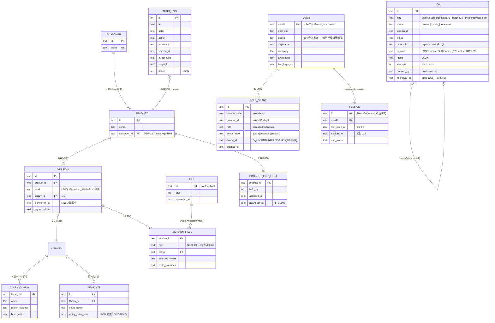

設計重點:

- **rules 不在 DB**:規則歸團隊以 code 維護(stub 介面),product 層級、跨版不變、app 無編輯面。
- **授權語意規則在 API 層擋、DB 只擋形狀**(之後開放 dept-editor 改一行):admin ⇒ global+個人;dept grant 目前僅 viewer;`scope_id=''` ⇔ global。
- **clone 語意**:建新版 = 複製 library(templates + class_config)+ 複製 version_files 綁定;毫秒級。
- **檔案去重天然免費**:`files.id` = content-hash;跨版共用零重複 bytes。
- **引擎**:prod = IT 維運 MariaDB(utf8mb4/InnoDB,**READ COMMITTED** — REPEATABLE READ 實測會跨 replica 舊讀);dev/測試 = SQLite。schema 由 **Alembic** 管(`alembic/versions/`);store 的 `*_SCHEMA` 常數僅供 SQLite bootstrap。

### 5.2 Blob 佈局(MinIO,boto3,key = DATA_DIR 相對路徑)

```
uploads/{file_id}.dxf                       ← content-hash, 跨版共用
parsed/{version_id}/{file_id}.json          ← 以版本為 key(選層是 per-version 狀態)
prematch/{version_id}/{file_id}.json
match/{version_id}/{file_id}.json           ← v2 重跑不會覆蓋 v1(N2)
rule_check/{version_id}.json
layer_preview/{version_id}/{file_id}/…      ← SVG 縮圖 + manifest + transient primitives
```

`BlobStore` 雙後端(`app/blobstore.py`):**Local**(預設,key→`data/` 路徑 1:1,dev/測試零行為差)與 **S3**(`S3_ENDPOINT_URL` 觸發,boto3 — 公司規定)。miss 一律 `FileNotFoundError`;150MB 大檔走 streaming + per-request scratch,絕不整包進記憶體。關鍵不變量:**任何衍生 artifact 都以 `(version_id, file_id)` 為 key**。

## 6. 高層架構

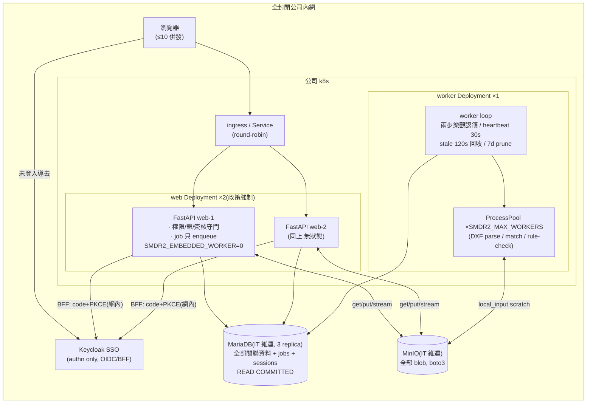

組件責任:

| 組件 | 責任 | 為什麼這樣切 |
|------|------|-------------|
| web ×2(FastAPI) | API、BFF 登入、權限/鎖/簽核守門、job **enqueue only** | 無狀態 → 滾動更新零中斷;k8s 政策要求 2 pod |
| worker ×1 | 認領 + 執行全部 CPU-bound job;ProcessPool 隔離 | 滾動更新不殺到跑一半的 preprocess;kill 後 job 120s 自動復活 |
| MariaDB | 關聯資料 + **jobs queue** + sessions + grants + locks + audit | IT 維運/備份;jobs 表同時解掉跨 replica 輪詢與去重 |
| MinIO | 全部 blob(§5.2) | IT 維運;物件儲存天生併發安全 |
| Keycloak | authentication only(`preferred_username` = userid) | 授權全在 app 本地判 — 換 IdP 不動權限邏輯 |
| nginx(dev)/ingress(prod) | round-robin、`client_max_body_size 200m` | dev compose 刻意鏡像 2-pod 形態,跨 replica bug 在本地浮現 |

**dev = prod 縮小鏡像**:`docker-compose.yaml` 起 nginx LB + web×2 + worker + MariaDB + MinIO + Keycloak(realm import 仿公司 JWT 自訂 claims,測試帳號 admin1/editor1/editor2/viewer1);環境差異 100% 收斂 env var,上 k8s 只換 config(prod secrets 走 Vault)。

## 7. 細部設計

### 7.1 Job queue(✅ 已實作)

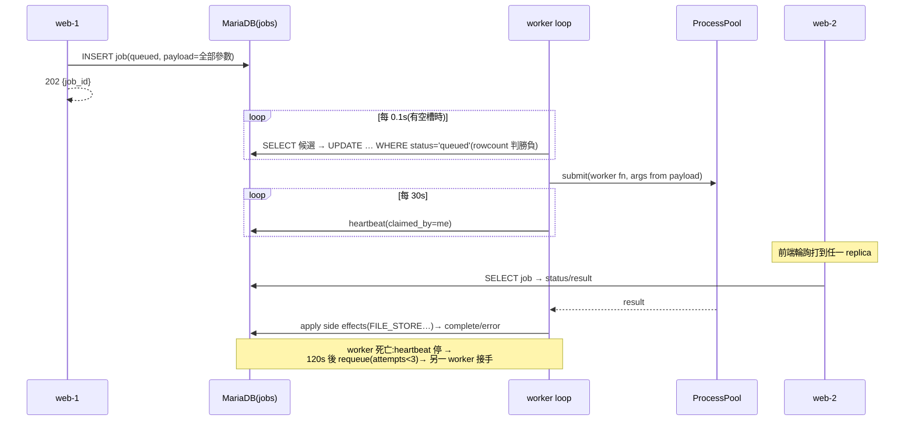

- **兩步樂觀認領**而非 `FOR UPDATE SKIP LOCKED`:MySQL 系禁止 UPDATE 子查詢引用同表、SQLite 沒有 SKIP LOCKED;兩步協定兩引擎語意一致,≤10 併發無吞吐顧慮。
- payload 在 **submit 時於 web 進程解析完**(含 dev-override snapshot)— 執行 worker 可能在另一個 pod。
- `reprocess-all`:父 job 一列(total/done/skipped/errors),子 job 是真實 preprocess 列(`parent_id`),完成原子 bump 父進度 — 任一 worker、任一 replica 都對。
- dev/測試:**embedded worker thread**(`SMDR2_EMBEDDED_WORKER` 預設開)→ 單容器、單進程、測試套件零設定。
- 已用 compose 實證:跨 replica 輪詢、worker 容器認領、kill-worker 中途 → 120s requeue → attempts=2 完成。

### 7.2 編輯 session(鎖 + 守門,Phase 3 掛上 API)

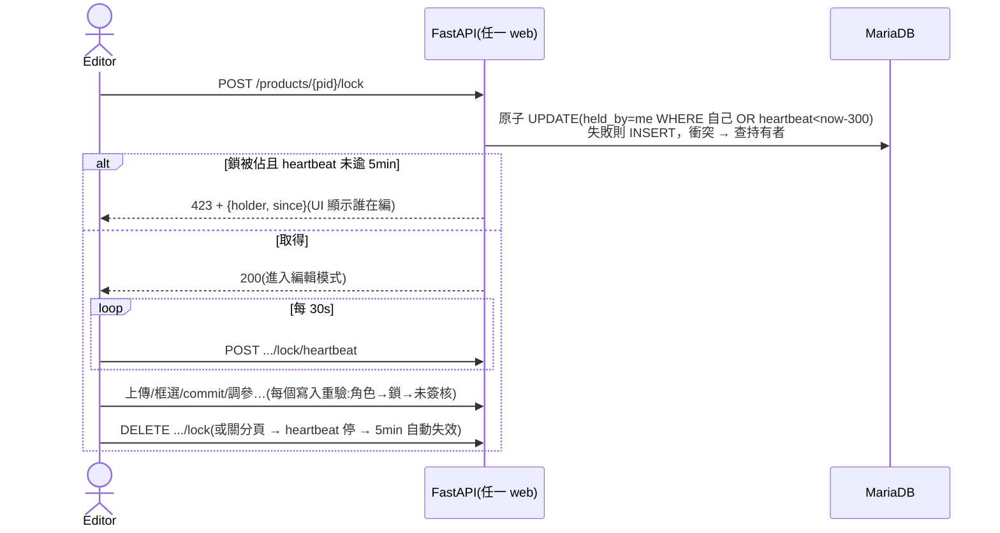

- 鎖協定已實作於 `AuthStore`(單句原子 UPDATE/INSERT + rowcount,**兩 replica 同搶不會雙贏**)。
- viewer 讀路徑永不檢查鎖;背景 job 視為持鎖者動作(冪等衍生資料,不另驗鎖)。
- admin `?force=1` → 寫 audit(`lock.force_release`,記前持有者)。

### 7.3 認證與授權(Phase 3)

- **認證 = Keycloak OIDC,BFF 模式**:後端做 Authorization Code + PKCE,前端只拿 HttpOnly SameSite=Lax cookie,token 不進 JS。雙 URL 設計:`OIDC_ISSUER`(瀏覽器面向,token 的 iss)/ `OIDC_INTERNAL_BASE`(網內呼叫)— compose 以 `KC_HOSTNAME` + `KC_HOSTNAME_BACKCHANNEL_DYNAMIC` 驗證過 issuer 一致;k8s 對應 ingress URL vs cluster service URL。
- **身分**:`preferred_username` = userid(公司硬性要求;`sub` 僅留存)。首登自動建帳(**無任何 grant**)+ `user.first_login` audit;每次登入刷新 `deptid/deptname/email/name` → **換部門者,部門授權自動跟動**。
- **授權全自建**(A4 介接一題已蒸發):`role_grants` 一張表,個人/部門 × 三角色 × 三範圍;判定一條 SQL(§4)。第一個 admin 走 `BOOTSTRAP_ADMINS` env,冪等 seeding。
- **Session**:server-side,DB 存 SHA-256(token);idle 8h / 絕對 24h(離職者最壞 24h 失效);變更類請求驗 `X-CSRF-Token`;health/metrics 豁免。
- **模式開關**:`SMDR2_AUTH_MODE=bypass`(預設,`SMDR2_DEV_USER` 合成 admin = 現行行為,640+ 測試零變化)/ `oidc`(prod 切換)。

### 7.4 版本生命週期(✅ 已實作;Phase 3 接上真實身分)

```mermaid
stateDiagram-v2
    [*] --> 編輯中 : 建 product(admin, 必填版號+customer)<br/>或建新版 = clone 上一版
    編輯中 --> 已簽核 : editor 簽核(含自己建的版;記誰/何時, audit)
    已簽核 --> 編輯中 : 僅 admin 解簽核(audit)
    已簽核 --> [*] : 永久保留, 唯讀可回看, 不可刪
```

- 簽核 guard 在**寫入守門鏈**統一擋(server 端,非前端);簽核後 reprocess-all 也跳過該版(frozen)。
- clone:單交易複製 library + version_files;衍生 artifact 不 clone(新版重算,沿用檔+未改範本結果天然相同)。

### 7.5 比對管線(版本感知,✅ 已實作)

```
上傳(版本 vid, 角色 POD)
  → content-hash 去重 → blob: uploads/{file_id}.dxf
  → version_files(vid, POD, file_id) upsert
  → job: discover(layer manifest+SVG → blob)→ 選層 → job: preprocess
       → blob: parsed/{vid}/{fid}.json + prematch
  → 框選 → live match → commit 範本(vid 的 library;audit @Phase 3)
  → save-match job → blob: match/{vid}/{fid}.json
  → rule-check job(product 規則 × vid 全部角色檔)→ blob: rule_check/{vid}.json
```

worker I/O(150MB 友善):`blobs.local_input(key)` 把 DXF stream 到 per-request scratch → worker 純本地讀寫 → 輸出 `put_json` 回 blob;scratch 用完即刪。

## 8. 失效模式與韌性

| 失效 | 影響 | 對策 |
|------|------|------|
| web pod 重啟/滾動更新 | 無 — web 無狀態 | 2 replica + DB session/jobs,LB 自動分流 |
| worker pod 被殺(滾動/OOM) | 跑一半的 job 中斷 | heartbeat 停 → **120s 後 requeue**(attempts<3),另一 worker 接手(已實證);≥3 次 → error |
| 編輯中斷線/關分頁 | 鎖懸掛 | heartbeat 停 → TTL 5min 自動過期;急用 admin force(audit) |
| 跨 replica 舊讀 | 一台 replica 凍結視圖(實測踩過) | MySQL 引擎強制 **READ COMMITTED** |
| MariaDB 連線過夜被斷 | 第一個請求炸 | `pool_pre_ping` + 斷線重連重試一次(`app/db.py`) |
| 寫 blob 中斷 | 不完整物件 | 衍生資料冪等重跑;S3 PUT 原子(不會半個物件) |
| 150MB DXF OOM | worker 被 OOMKill | 已實測峰值 6.3GiB → pod request ≥8GiB 或限大檔併發;OOM 後 job 自動 requeue |
| 已簽核版被改 | 完整性破壞 | 守門鏈 server 端統一擋 + audit |
| 版號重複 | 語意衝突 | DB UNIQUE(product_id, label) → 409 |
| 重複 grant / 重複 global grant | 授權混亂 | UNIQUE 五欄複合 + `scope_id=''` 哨兵(NULL 會讓 UNIQUE 失效) |
| 無 grant 用戶登入 | 看到空系統 | 設計如此(viewer 也分範圍);上線前 admin 預先 grant |

## 9. 已知地雷(實作時必看)

- ❌ MinIO client / DB 連線**不 fork-safe** → worker 內 lazy 建立(`get_blobstore()` 每進程自行解析),絕不從 module-level 繼承。
- ❌ worker 用 `LIBRARIES` 記憶體 cache → stale;web 端同理(跨 pod)— **已全面改 fresh read**,registry 每次重建 Library。
- ❌ `lru_cache` 以本地 mtime 為 key 在物件儲存失效 → 已改 `BlobStore.stat()`(本地 mtime_ns / S3 ETag)。
- ❌ transient `primitives.json` 洩漏 → Phase 2 成功即刪;孤兒清理掛 prune。
- ❌ dev_overrides 是 process-local → 跨 pod 分岔;prod 以 `SMDR2_DEV_TOOLS=0` 整組關閉。
- ❌ `INSERT/UPDATE OR IGNORE`、qmark 參數等 SQLite 方言 → 集中在 `app/db.py` 翻譯,store 不准再長新的方言。

## 10. 主要取捨(為什麼不是別的)

| 決策 | 取 | 捨 | 理由 |
|------|----|----|------|
| 版本模型 | 同 product 下的 version | 每版開新 product | rules 跨版共用;開新 product = 規則 drift |
| 快照策略 | 整組 clone(≤20 版) | base + diff | 量小;diff 結構複雜易錯 |
| 關聯儲存 | **MariaDB(IT 維運)** | SQLite+Litestream(舊 Plan A)/ Oracle port | 2026-06-11 得知公司有 MariaDB 且有人管 → 單寫者限制與備份負擔同時消失;SQLite 留測試/dev |
| DB 介面 | SQLAlchemy **Core** 藏在 sqlite3 形狀 facade 後 | ORM 重寫 / 雙驅動 if-else | 5 個 store ~107 個 call site 幾乎零改動;方言翻譯集中一處 |
| Job queue | **DB 表 + 兩步樂觀認領** | Redis/Celery / SKIP LOCKED | 不加元件;兩引擎語意一致;量級遠不需 SKIP LOCKED |
| worker 形態 | 獨立 Deployment + embedded 開關 | 全 web 內嵌 / 全強制拆 | k8s 滾動不殺 job;dev/測試零設定 |
| 認證 | Keycloak BFF(cookie) | token 進前端 JS | XSS 面最小;前端零 token 邏輯 |
| 身分 key | `preferred_username` | `sub`(舊定案) | 公司硬性要求(2026-06-11 推翻舊案) |
| 授權存放 | **app DB 自建**(grants 表) | Keycloak roles / A4 系統 | per-product/customer/dept 粒度 IAM 表達不了;換 IdP 不動權限 |
| viewer 範圍 | 也分 global/customer/product | 登入即看全部(舊定案) | 客戶間資料敏感(2026-06-11 推翻舊案) |
| global scope 表示 | `scope_id=''` 哨兵 | NULL | 兩引擎 UNIQUE 都視 NULL 互不相等 → 防重失效 |
| 併發控制 | product 級悲觀鎖 | 樂觀鎖(ETag) | 編輯是數十分鐘連續互動;樂觀鎖存檔才報衝突 → 白做工 |
| 簽核凍結 | server 端守門鏈 | 前端 disable | API 直打也要擋 |
| 隔離級別 | READ COMMITTED | InnoDB 預設 REPEATABLE READ | 長連線 + 預設隔離 = 跨 replica 凍結視圖(實測) |

## 11. 演進路徑

1. **worker 水平擴展**:認領協定天然支援多 worker,replicas 純調 yaml;先單 worker 觀察。
2. **版本 diff 視圖**:✅ 已做(C6)。
3. **dept grant 開放 editor**:API 層一行;schema 不限死。
4. **範本庫種子**:若「每 product 重框標準件」太痛,可引入 clone-on-create 種子庫,不破壞現模型。
5. **比對效能**:ProcessPool 跨範本平行 + circle fast path(獨立 change)。

## 12. 視圖集(C4 / 流程 / DFD / UML)

### 12.1 C4-L1:System Context

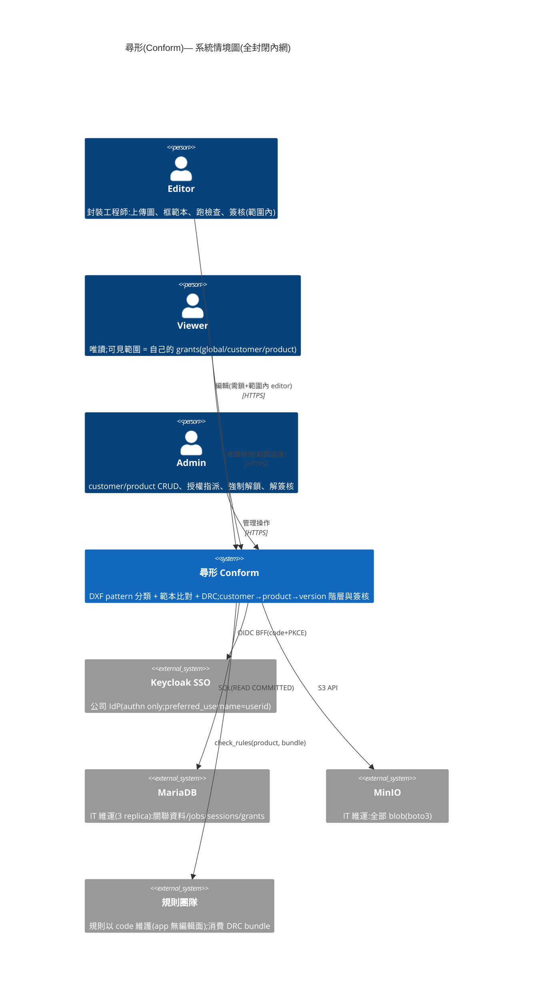

### 12.2 C4-L2:Container

```mermaid
C4Container
    title 尋形 — 容器圖(公司 k8s;web×2 政策強制)
    Person(user, "Editor / Viewer / Admin")
    System_Ext(kc, "Keycloak SSO")

    Container_Boundary(k8s, "k8s") {
        Container(ing, "ingress / Service", "round-robin", "client_max_body_size 200m")
        Container(web1, "FastAPI web ×2", "Python / uvicorn, 無狀態", "API、BFF、守門鏈;job 只 enqueue(SMDR2_EMBEDDED_WORKER=0)")
        Container(worker, "worker ×1", "python -m app.worker_loop", "兩步認領、heartbeat、stale 回收;ProcessPool 執行 parse/match/rule-check")
        Container(front, "Viewer 前端", "HTML + canvas.js", "AutoCAD 式互動:框選、live match、版本切換、鎖狀態顯示")
    }
    ContainerDb(maria, "MariaDB", "IT 維運, utf8mb4/InnoDB", "12+ 表:products/versions/libraries/templates/version_files/files + users/customers/role_grants/sessions/audit_log/product_edit_locks + jobs")
    ContainerDb(minio, "MinIO", "S3(boto3)", "uploads(content-hash)、parsed/prematch/match/rule_check/layer_preview 以 (version,file) 為 key")

    Rel(user, front, "瀏覽器")
    Rel(front, ing, "JSON API", "HTTPS")
    Rel(ing, web1, "round-robin")
    Rel(web1, kc, "BFF code+PKCE(網內 URL)")
    Rel(web1, maria, "SQL + jobs INSERT/SELECT")
    Rel(web1, minio, "get/put/stream")
    Rel(worker, maria, "claim/heartbeat/complete")
    Rel(worker, minio, "local_input scratch / put_json")
```

### 12.3 C4-L3:Component(app 內部,依實作模組)

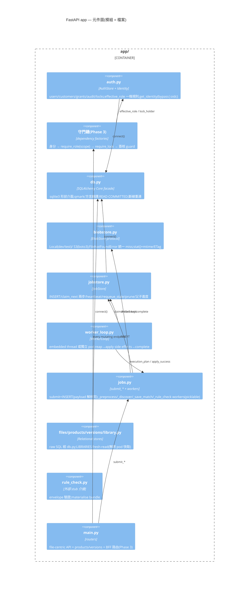

### 12.4 系統流程圖(end-to-end 業務流程)

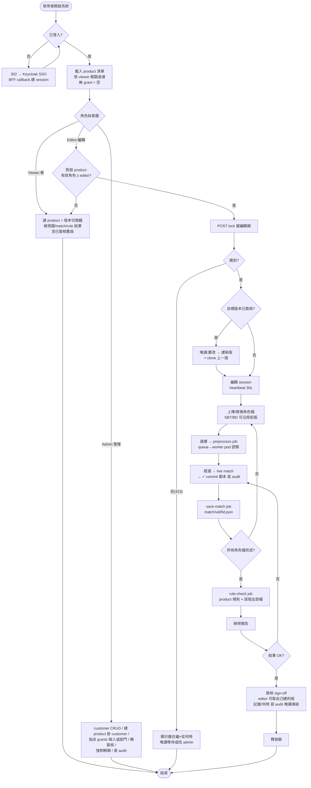

### 12.5 DFD-L0(Context)

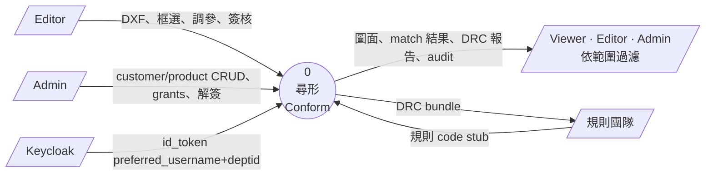

### 12.6 DFD-L1(主要 process 與 data store)

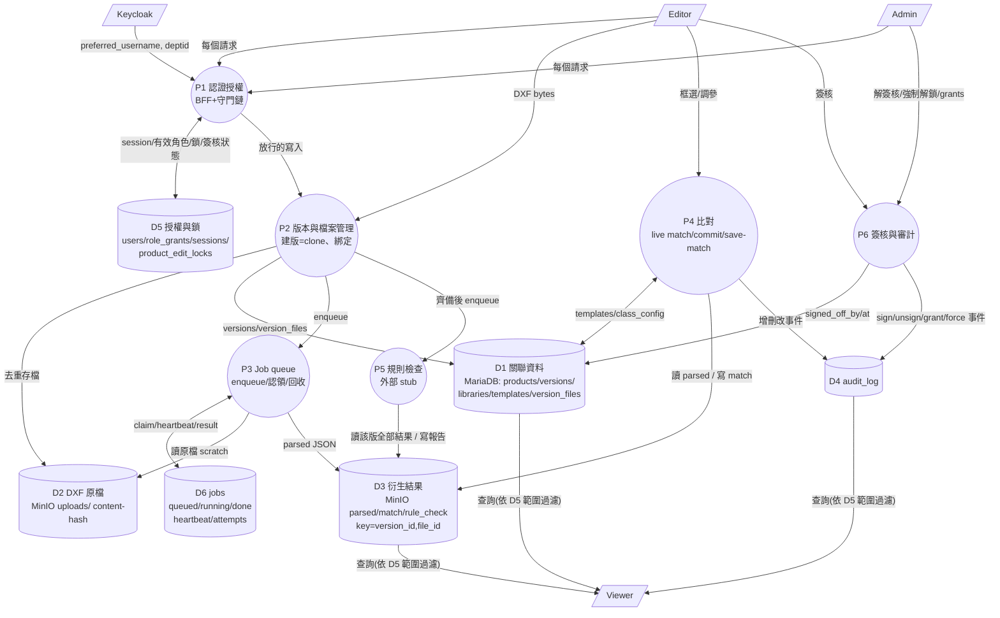

### 12.7 UML Use Case 圖

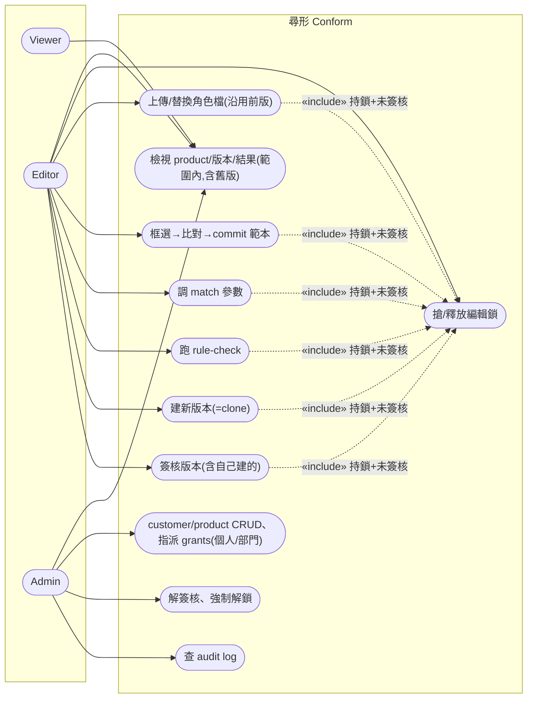

### 12.8 UML Class 圖(領域模型)

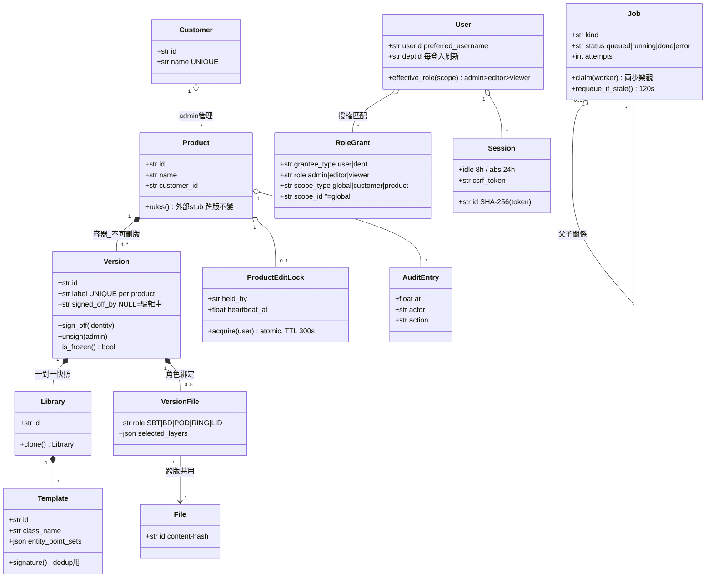

### 12.9 UML Sequence:建新版 → 換 POD → 比對 → 簽核

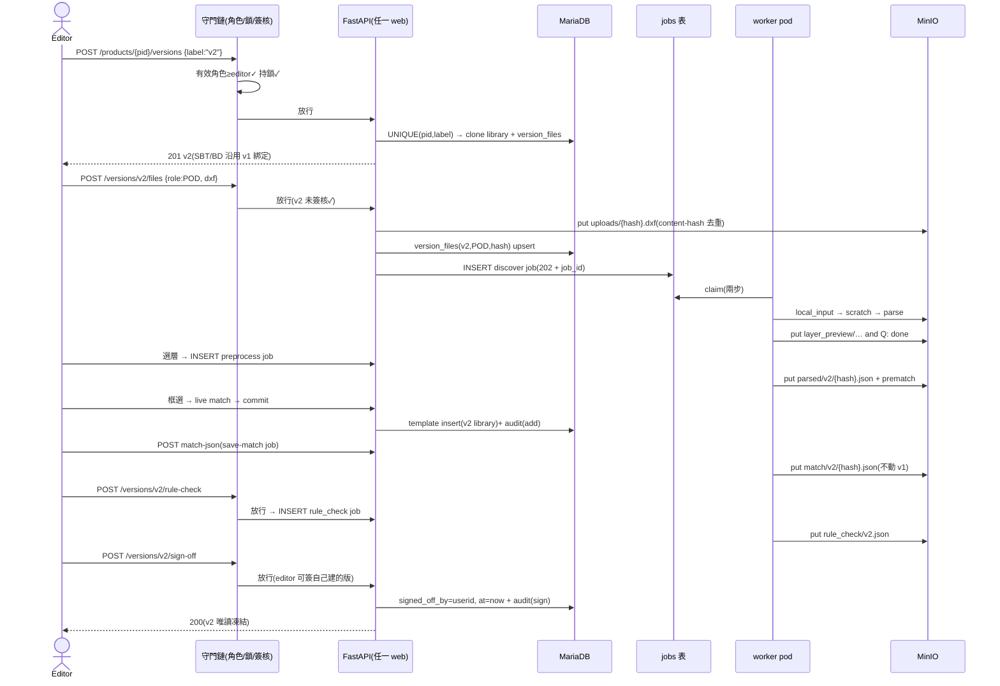

### 12.10 UML Sequence:鎖競爭與 admin 介入

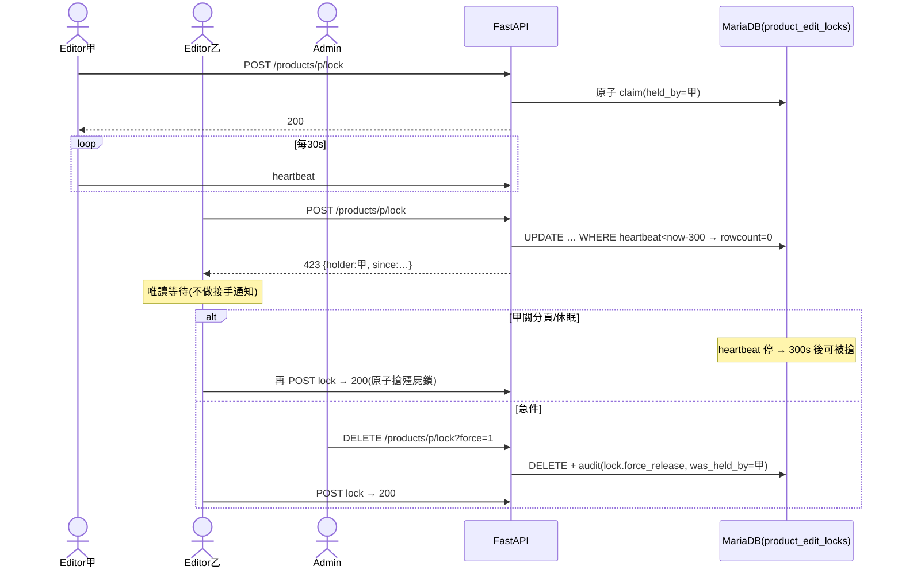

### 12.11 State:Job 生命週期(✅ 已實作)

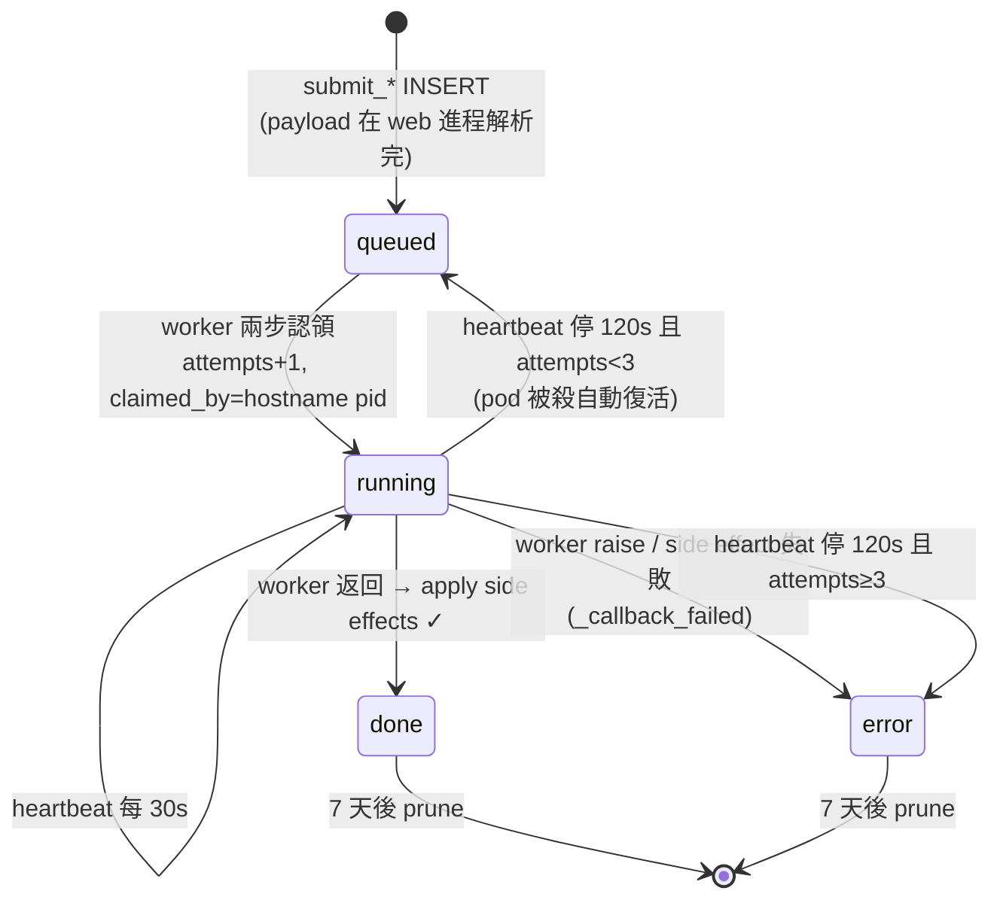

### 12.12 State:檔案處理管線(單一角色檔)

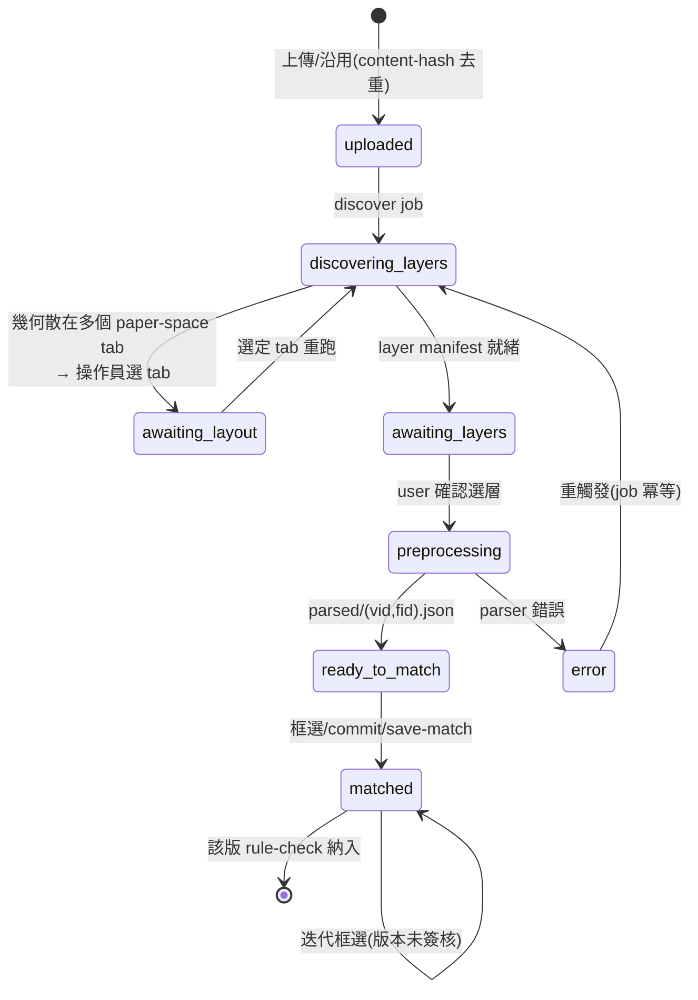

### 12.13 Activity:寫入守門鏈(所有 mutating endpoint)

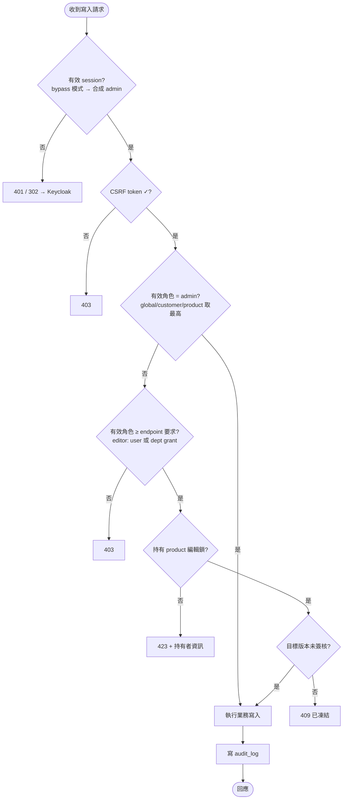

## 13. 施工狀態與順序

依 `openspec/changes/add-production-infra-and-auth/`(proposal/design/specs/tasks);dev 全程在 docker-compose 鏡像環境驗證,搬 k8s 只換 env。

| Phase | 內容 | 狀態 |
|---|------|------|
| 0 | compose dev 環境(LB+web×2+worker+MariaDB+MinIO+Keycloak)、schema 定稿、auth store + 23 測試 | ✅ |
| 1 | `app/db.py`(SQLAlchemy Core facade)+ Alembic + 五 store 換接;`app/blobstore.py` 雙後端 + 全 I/O 改 key;150MB 實測 | ✅ |
| 2 | `jobs` 表 + `worker_loop`(認領/heartbeat/回收/prune);移除 in-memory dict 與 web executor;LIBRARIES fresh-read;dev tools gate → **replicas=2 解鎖** | ✅ |
| 3 | BFF 登入 + sessions/CSRF;權限 dependency 按矩陣掛全 endpoint(bypass 預設零行為差);編輯鎖 API + 前端;admin UI(customers/grants/audit) | 🔨 |
| 4 | launch readiness 殘項(logging/json-guard)、k8s manifests、oidc 切換演練、docs 同步 | ⬜ |

外部待取:Keycloak realm/client/issuer(dev 走 .env、prod 走 Vault)、DBA 連線與專用 schema。
