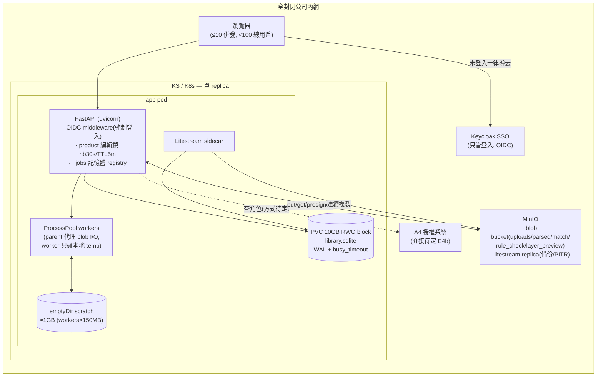
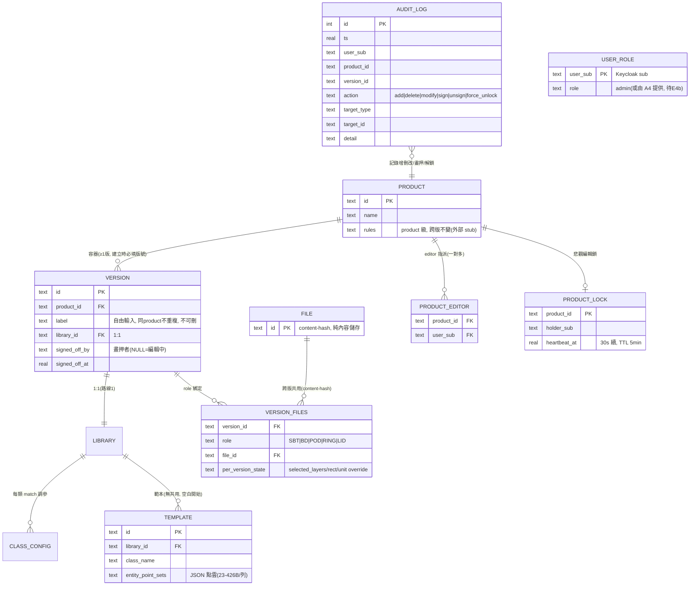
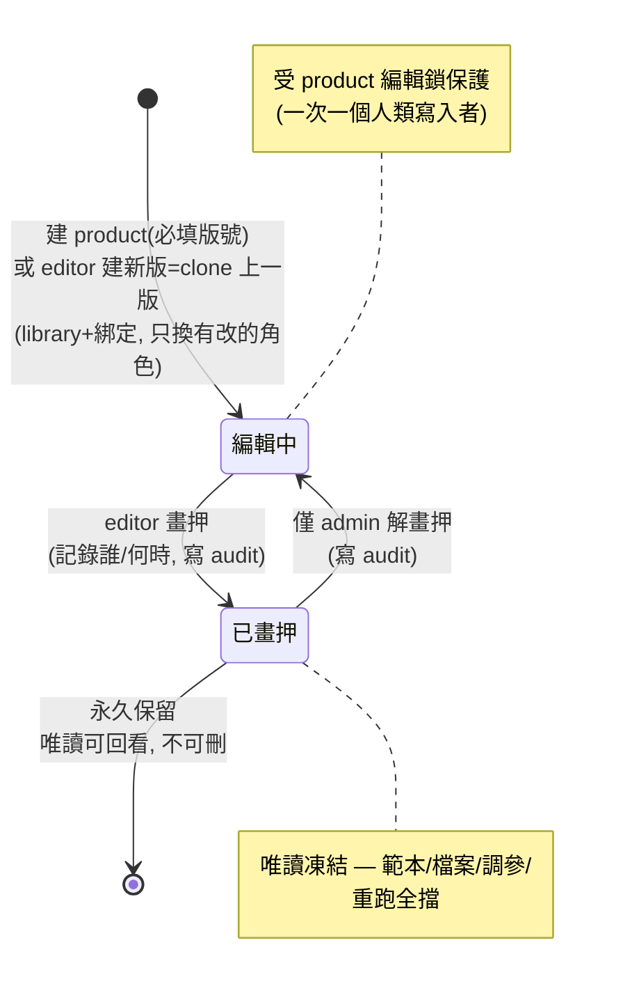

# 系統設計圖(target architecture)

> 狀態:依 2026-06-10 全部定案繪製(見 [`DISCUSSION.md`](DISCUSSION.md));**尚未實作**,是目標架構。
> 唯一未定:A4 授權系統的介接(虛線標示,等 E4b 回覆)。

---

## 1. 部署架構(全封閉網路 / TKS K8s)

要點:**「多人」靠單 replica 內的鎖與 auth 解,不靠多 replica**(`_jobs` 在記憶體,天生單 replica;HA 是未來牌)。`library.sqlite` 絕不放 MinIO/NFS。

---

## 2. 資料模型(ER)

衍生 artifact(MinIO,不在 DB):`uploads/{file_id}.dxf`(跨版共用)、`parsed|match|prematch/{version_id}/{file_id}.json`、`rule_check/{version_id}.json` —— **以 version 為 key,舊版永久可回看**。

---

## 3. Version 生命週期(畫押狀態機)

---

## 4. 權限模型(三級)

| 角色 | 取得方式 | 能做什麼 |
|---|---|---|
| **Viewer** | 能登入 Keycloak 即是 | 看**所有** product/版本/結果(全部可看) |
| **Editor** | admin 指派(per-product, 一對多) | 被指派 product 內全部動作:上傳/換檔、範本增刪改、調參、rule-check、**建新版**、**畫押** |
| **Admin** | env 白名單或 A4(待 E4b) | + 建/刪 product、指派 editor、強制解鎖、**解畫押** |

身分 key = Keycloak `sub`;角色儲存:App DB 兩張表(若 A4 強制則混合制,待 E4b)。

---

## 5. 對應的施工順序(建議)

1. **versioning + 拓樸轉換**(§2/§3 的 schema;不遷移,砍掉重練)
2. **Plan A 儲存**(BlobStore + MinIO + Litestream;§1 右半)
3. **auth + 編輯鎖 + audit**(§1 左半 + §4;等 A4/infra 回覆 E2/E3/E4b)
4. 150MB DXF perf 驗證(獨立,隨時可做)
