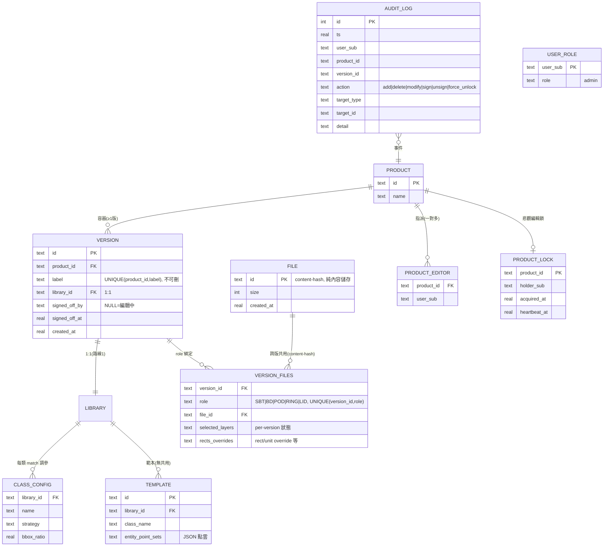
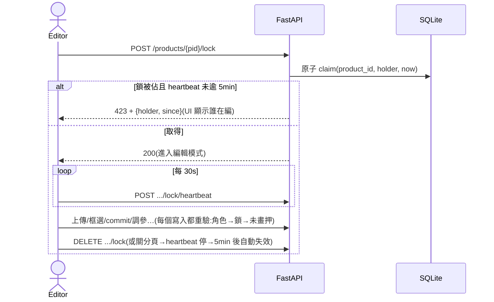
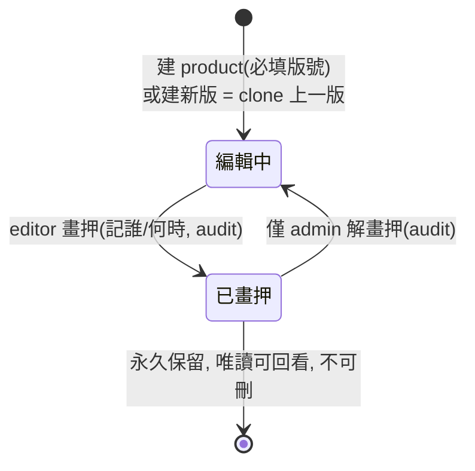

# 尋形(Conform / SMDR2)完整系統設計

> 狀態:目標架構設計書,依 2026-06-10 全部定案撰寫(決策出處見 [`DISCUSSION.md`](DISCUSSION.md))。**尚未實作**。
> 唯一未定:A4 授權系統介接(§7.2 虛線標示,等 E4b)。
> 文件結構仿系統設計面試:問題 → 需求 → 容量 → API → 資料 → 架構 → 細部設計 → 失效 → 取捨 → 演進。

---

## 1. 問題陳述

半導體封裝廠的工程師需要對每個料號(product)的多張設計圖(DXF)做 **設計規則檢查(DRC)**。檢查前要先把圖上的幾何 pattern(基板外框、BGA ball、SMD 件、fiducial…)**分類標記**——做法是工程師框選一個樣本、系統比對出全圖所有同形實例(template matching),累積成該料號的範本庫,最後對整組圖跑規則檢查產出報告。

同一料號會**改版**(每版只改一兩個小東西,部分圖紙沿用前版),檢查規則跨版不變。多位工程師(≤10 併發)要同時在不同料號上作業,完成的版本要**畫押**(sign-off)凍結,且舊版結果要**永久可回看**。

## 2. 需求

### 2.1 功能需求

| # | 需求 | 決策出處 |
|---|------|---------|
| F1 | 上傳 DXF(5 種角色:SBT/BD/POD/RING/LID)、選層、預處理、渲染 | 既有 |
| F2 | 框選 pattern → 即時比對 → commit 成範本;範本庫隨用隨長 | 既有 |
| F3 | product 級規則檢查(規則由外部團隊提供,跨版本不變) | 既有 + C 組 |
| F4 | **版本管理**:product 下多版本,版號自由輸入、同 product 不重複、不可刪 | C1–C9 |
| F5 | **建新版 = clone 上一版**(library + 檔案綁定),只替換有改的角色檔 | C1/C5 |
| F6 | **畫押**:editor 完成後對版本畫押 → 唯讀凍結、顯示誰/何時;僅 admin 可解 | B5 |
| F7 | **舊版永久可回看**(含當時的 match / rule 結果) | C4 |
| F8 | **三級權限**:Admin / Editor(per-product 指派)/ Viewer(登入即看全部) | §B、A3 |
| F9 | **編輯鎖**:同一 product 同時只有一個 editor 能編 | D 組 |
| F10 | **audit log**:library 增刪改、畫押/解畫押、強制解鎖,記誰/何時/什麼 | F2 |

### 2.2 非功能需求

| # | 需求 | 含義 |
|---|------|------|
| N1 | **低維護、小技術棧** | 不上 ORM/Redis/MQ;能用 env var 就不上設定框架 |
| N2 | **舊版可重現** | v2 的任何編輯(含調參)不得影響 v1 的結果 |
| N3 | **全封閉內網** | 無外網暴露面;TLS/網段控管在部署層 |
| N4 | 強制登入(Keycloak SSO),未登入一律導去 login | F3 定案 |
| N5 | 單 replica 即可(無 HA 要求);「多人」≠「多 replica」 | multi-user-readiness |
| N6 | 備份:Litestream 連續複製,RPO 數秒可接受(內部工具) | Plan A |

### 2.3 明確不做(out of scope)

- 即時共編(WebSocket)——被擋者唯讀 + 輪詢鎖狀態即可。
- 版本 diff 視圖(C6 延後;資料是完整快照,日後可加)。
- 多 replica / HA(`_jobs` 外部化是未來牌)。
- 資料遷移(C9:dev 資料砍掉重練)。

## 3. 容量估算

| 維度 | 數字 | 推論 |
|------|------|------|
| 用戶 | ≤10 併發 / <100 總數 | 單 replica + ProcessPool 足夠;web 層極輕,重活在 CPU 比對 |
| 檔案 | <500 DXF/年,單檔 ≤**150MB** | blob 最壞 ~75GB/年 → MinIO 輕鬆。⚠️ 150MB 單檔未驗證(現有資料總量才 62MB):parser/worker 記憶體要實測,scratch = worker 數 × 150MB |
| 版本 | ~150 version/年(≤20 版/product) | clone 模型下 SQLite 最壞 ~300MB/年(template 一列僅 23–426B,實測) |
| DB | 五年 worst ~1.5GB | **PVC 申請 10GB RWO block** 綽綽有餘 |
| 比對 | scan-all 51 範本 ≈ 7s(2026-05 實測) | 範本數隨版本累積,ProcessPool 平行化是既定方向 |

讀寫比:極度讀多寫少。寫入尖峰 = 編輯 session 中的 commit/調參(單人單 product,有編輯鎖序列化);讀取 = viewer 看圖/結果(無鎖、無限制)。

## 4. API 設計

既有 API 為 file-centric(`/api/files/{file_id}/…` 做選層/比對/commit),版本化後**file 操作介面不變**(file_id 仍是 content-hash),變的是**綁定與結果的歸屬**。新增/異動如下(僅列差異,完整以 OpenSpec change 為準):

```
# 身分
GET    /api/me                                  → {sub, name, role, editable_products[]}

# Product(admin only 建/刪)
POST   /api/products            {name, version_label}     → 建 product + 第一版(必填版號)
DELETE /api/products/{pid}                                → admin only
GET    /api/products                                       → 全部可見(A3)
PUT    /api/products/{pid}/editors  {user_subs[]}          → admin 指派

# Version
POST   /api/products/{pid}/versions  {label, clone_from?}  → 建新版(預設 clone 最新版;label 重複 → 409)
GET    /api/products/{pid}/versions                        → 含 signed_off_by/at
POST   /api/versions/{vid}/files     {role, dxf}           → 上傳/替換該版某角色檔(沿用不必重傳)
DELETE /api/versions/{vid}/files/{role}                    → 解除綁定
POST   /api/versions/{vid}/sign-off                        → editor 畫押(冪等;已畫押 → 409)
DELETE /api/versions/{vid}/sign-off                        → admin 解畫押

# 編輯鎖(product 級)
POST   /api/products/{pid}/lock                            → 搶鎖(被佔 → 423 + 持有者資訊)
POST   /api/products/{pid}/lock/heartbeat                  → 30s 一次
DELETE /api/products/{pid}/lock                            → 釋放;admin 可帶 ?force=1 搶走(寫 audit)

# 規則檢查(歸屬版本)
POST   /api/versions/{vid}/rule-check                      → 觸發(背景 job)
GET    /api/versions/{vid}/rule-check                      → 該版結果(舊版永久可看)

# Audit
GET    /api/audit?product_id=&version_id=&user=&action=    → 查詢(分頁)

# 既有 file-centric 端點(layers/match/commit/scan-all…)
#   介面不變;後端以 version_files 解析 file 在「當前編輯版本」的狀態,
#   結果寫到 (version_id, file_id) keying。
```

**權限矩陣(middleware 統一裁決):**

| 動作 | Viewer | Editor(被指派) | Admin |
|---|---|---|---|
| 看所有 product/版本/結果 | ✅ | ✅ | ✅ |
| 上傳/換檔、範本增刪改、調參、rule-check、建新版、畫押 | ❌ | ✅(限未畫押版 + 持有鎖) | ✅ |
| 建/刪 product、指派 editor、強制解鎖、解畫押 | ❌ | ❌ | ✅ |

**寫入守門順序**(每個 mutating endpoint):登入 → 角色 → 是否該 product 的 editor → 是否持有編輯鎖 → 目標版本未畫押 → 執行 → audit。

## 5. 資料模型

### 5.1 ER 圖



設計重點:

- **rules 不在 DB**:規則邏輯歸外部團隊(stub 介面),掛 product 層級、跨版不變。「按版本改規則」被明確擋掉——那要開新 product。
- **兩層 scope 已刪除**:`PRODUCT_SCOPED_CLASSES` 與雙 scope merge 全部移除,所有範本一律屬於某版本的 library。
- **clone 語意**:建新版 = 複製 library(templates + class_config 整包)+ 複製 version_files 綁定。templates 列極小(23–426B),20 版上限下複製成本可忽略(§3)。
- **檔案去重天然免費**:`files.id` = content-hash;v1/v2 共用同一 SBT 時 bytes 零重複,只是兩列 `version_files` 指同一 file_id。

### 5.2 Blob 佈局(MinIO,不在 DB)

```
uploads/{file_id}.dxf                       ← content-hash, 跨版共用
parsed/{version_id}/{file_id}.json          ← 以版本為 key(選層是 per-version 狀態)
prematch/{version_id}/{file_id}.json
match/{version_id}/{file_id}.json           ← v2 重跑不會覆蓋 v1(N2 舊版可重現)
rule_check/{version_id}.json
layer_preview/{version_id}/{file_id}/…
litestream/…                                ← SQLite 連續備份
```

關鍵不變量:**任何衍生 artifact 都以 `(version_id, file_id)` 為 key**。共用檔案的 bytes 只有一份,但每個版本的解讀(選層)與結果(match)各自獨立、永久保留。

## 6. 高層架構

```mermaid
flowchart LR
    subgraph net["全封閉公司內網"]
        B["瀏覽器<br/>(≤10 併發)"]
        KC["Keycloak SSO<br/>(只管登入, OIDC)"]
        A4["A4 授權系統<br/>(介接待定 E4b)"]

        subgraph k8s["TKS / K8s — 單 replica"]
            subgraph pod["app pod"]
                APP["FastAPI (uvicorn)<br/>· OIDC middleware(N4)<br/>· 權限/鎖/畫押守門(§4)<br/>· _jobs 記憶體 registry"]
                WK["ProcessPool workers<br/>(parent 代理 blob I/O)"]
                LS["Litestream sidecar"]
                SCR[("emptyDir scratch<br/>≈1GB")]
            end
            PVC[("PVC 10GB RWO block<br/>library.sqlite<br/>WAL + busy_timeout")]
        end

        MINIO["MinIO<br/>blob bucket + litestream replica"]
    end

    B -->|未登入導去| KC
    B --> APP
    APP -.->|角色查詢(待定)| A4
    APP --> PVC
    APP <-->|put/get/presigned| MINIO
    APP --> WK
    WK <--> SCR
    LS --> PVC
    LS -->|連續複製| MINIO
```

組件責任:

| 組件 | 責任 | 為什麼這樣切 |
|------|------|-------------|
| FastAPI(單行程) | API、權限裁決、編輯鎖、job 排程、blob 代理 | web 層輕;所有正確性守門集中一處 |
| ProcessPool workers | CPU-bound:DXF parse、template matching、rule-check | pickle 隔離行程;**只碰本地 temp 檔**,不持 MinIO 憑證、不碰 SQLite cache(重讀 invariant) |
| SQLite on PVC | 全部關聯資料(§5.1) | 單 replica 下零維護;**絕不放 MinIO/NFS**(locking + partial-write → 壞檔) |
| MinIO | 全部 blob(§5.2)+ DB 備份 | 物件儲存天生併發安全;pod ephemeral 化 |
| Litestream sidecar | SQLite → MinIO 連續複製 | 一個小 binary 換到 PITR,DB 程式碼零改動 |
| Keycloak | authentication only | E4a 定案;授權在 app(或混合 A4,待 E4b) |

## 7. 細部設計

### 7.1 編輯 session(鎖 + 守門)



- 鎖狀態存 DB(`product_lock` 表),搶鎖用單條 `UPDATE … WHERE heartbeat_at < now-300 OR holder IS NULL` 原子完成,不需額外協調器。
- **viewer 永遠不被鎖影響**(讀路徑不檢查鎖)。
- 背景 job 視為持鎖 editor 的動作;job 寫衍生資料且冪等,鎖只保證「同 product 單一人類寫入者」。
- admin `?force=1` 搶鎖 → 寫 audit(`force_unlock`)。

### 7.2 認證與授權

- **認證**:OIDC code flow → Keycloak;session cookie;唯一識別 = `sub`(email 僅顯示)。未登入的任何路由 → 302 到 Keycloak(N4)。
- **授權**(待 A4 回覆,兩個方案皆已設計):
  - **自管(預設)**:`user_roles`(只記 admin;登入即 viewer)+ `product_editors`。第一個 admin 用 env 白名單 `SMDR2_ADMIN_EMAILS`。
  - **混合(若 A4 強制)**:粗角色(admin/editor/viewer)從 A4 來(API/claim,介接方式待定),`product_editors` 細指派仍在 app DB。
- 離職/轉組:Keycloak 停帳號 → 登不進來 → 權限自然失效,app 不用清(F1)。

### 7.3 版本生命週期



- 畫押檢查在**寫入守門鏈**(§4)裡,所有 mutating endpoint 一致擋,不靠前端。
- clone 實作:單交易內複製 `library`(新 id)→ bulk-insert templates + class_config → 複製 `version_files` 列。~3000 列 × 數百 B,毫秒級。
- 衍生 artifact **不 clone**:新版的 parsed/match 由 job 重算(模板可能即將被改,clone 舊結果無意義);沿用檔 + 未改範本的情況,重算結果天然相同。

### 7.4 比對管線(版本感知)

```
上傳(版本 vid, 角色 POD)
  → content-hash 去重 → uploads/{file_id}.dxf(可能已存在,零寫入)
  → version_files(vid, POD, file_id) upsert
  → 背景 job:discover-layers → 選層(存 version_files)→ parse
       → parsed/{vid}/{file_id}.json
  → 編輯互動:框選 → live match → commit 範本(進 vid 的 library;audit)
  → scan-all → match/{vid}/{file_id}.json
  → rule-check(product 規則 × vid 的全部角色檔)→ rule_check/{vid}.json
```

worker I/O 模式(150MB 友善):parent 從 MinIO 下載到 scratch temp → worker 純本地讀寫 → parent 把輸出上傳 MinIO。憑證與網路不進子行程(fork-safety 地雷,§9)。

### 7.5 Audit log

- 同步寫(與業務寫入同交易)——內部工具量級(數百事件/天)無需異步管線。
- 涵蓋:範本/檔案/調參 add|delete|modify、sign|unsign、force_unlock。是否擴及檢視類事件:實作時再議,表結構已通用。

## 8. 失效模式與韌性

| 失效 | 影響 | 對策 |
|------|------|------|
| pod 重啟/當機 | `_jobs` 記憶體狀態消失 → 進行中 job 的 poll 404 | job 全部**冪等**、輸入都在(MinIO+DB),前端對 404 顯示「重新觸發」;可接受(內部工具) |
| 編輯中斷線/關分頁 | 鎖懸掛 | heartbeat 停 → TTL 5min 自動過期;急用 admin force(D1/D2) |
| SQLite 寫入競爭 | `database is locked` | WAL(已開)+ `busy_timeout`;寫入本來就被編輯鎖序列化,殘餘競爭僅 job 收尾 |
| 寫 blob 中斷 | 不完整物件 | 衍生資料可重跑;上傳走 staging key → 完成後才 upsert 綁定 |
| Litestream 落後時當機 | 丟最後數秒寫入 | RPO 數秒可接受(N6);範本可重 commit |
| MinIO 開機不可達 | app 起不來(blob 依賴) | 啟動健康檢查 + retry;MinIO 歸 infra 維運 |
| 150MB DXF OOM | worker 被 OOMKill | **上線前實測**;必要時:單大檔 job 限併發、worker memory limit、streaming parse |
| 已畫押版被改 | 資料完整性破壞 | 守門在 server 端寫入鏈統一擋(§7.3),非前端;另有 audit 可追 |
| 版號重複 | 語意衝突 | DB UNIQUE(product_id, label) → 409 |

## 9. 已知地雷(實作時必看)

- ❌ `library.sqlite` 放 MinIO / NFS → 靜默壞檔。PVC 必須 block storage RWO。
- ❌ MinIO client / DB 連線**不 fork-safe** → worker 內一律 lazy 建立,絕不從 module-level 繼承。
- ❌ worker 用 `LIBRARIES` 記憶體 cache → 跨 job stale,必須 `Store.load_library()` 重讀(既有 invariant)。
- ❌ `lru_cache` 以 mtime 為 key 在物件儲存失效 → 改 ETag/version。
- ❌ transient `primitives.json` 在 MinIO 會洩漏 → 明確刪除 + 定期孤兒清理。
- ❌ 測試目前會寫真實 dev DB(2026-06-10 發現:2500+ 測試 product 殘留)→ 測試必須隔離 DB,排進施工。

## 10. 主要取捨(為什麼不是別的)

| 決策 | 取 | 捨 | 理由 |
|------|----|----|------|
| 版本模型 | 同 product 下的 version | 「每版開新 product」 | rules 跨版共用;開新 product = 複製 N 份規則 → drift |
| 快照策略 | 整組 clone(≤20 版) | base + diff | 量小(MB 級);diff 結構複雜易錯;要看差異可事後算 |
| library 錨點 | 一 version 一 library | version_id 欄位散在 templates | clone 即快照;調參自動版本化(N2);schema 幾乎不動 |
| 範本共用 | 完全不共用,空白開始 | global library / clone 種子 | user 定案;隔離最乾淨,兩層 scope 邏輯整個刪掉 |
| 併發控制 | product 級悲觀鎖 | 樂觀鎖(ETag) | 編輯是數十分鐘連續互動;樂觀鎖存檔才報衝突 → 白做工 |
| 關聯儲存 | SQLite + Litestream | Oracle(公司唯一 DB)/ Postgres(沒有) | 可自管(G2);Oracle port 8–12 天且違背低維護;單 replica 下 SQLite 零短板 |
| 擴展策略 | 單 replica 垂直擴 | 多 replica HA | `_jobs` 在記憶體是硬牆;需求(≤10 人)遠不及門檻;HA 無人要求 |
| 授權存放 | App DB(或混合 A4) | 全放 Keycloak | per-product 指派放 IAM 要走流程,痛;Keycloak 定案只管登入 |
| 畫押凍結 | server 端守門鏈 | 前端 disable | 完整性不能靠前端;API 直打也要擋 |

## 11. 演進路徑(今天不做,但路留好)

1. **多 replica / HA**:前置 = `_jobs` 外部化(DB jobs 表或 Redis)。鎖已在 DB、blob 已在 MinIO,屆時只剩這一步 + 換 Postgres(若需要)。
2. **版本 diff 視圖**(C6):兩版皆完整快照,任何時候可加,零 schema 變更。
3. **audit 擴大**:表結構通用,加 action 枚舉即可。
4. **範本庫再共用**:若未來發現「每 product 重框標準件」太痛,可再引入種子庫(clone-on-create),不破壞現模型。
5. **比對效能**:範本數隨版本成長 → ProcessPool 跨範本平行(既定方向)+ circle fast path。

## 12. 施工順序

| # | 工作 | 阻塞 | 摘要 |
|---|------|------|------|
| 1 | versioning + 拓樸轉換(OpenSpec) | 無 | §5 schema、clone、畫押、API;不遷移,dev 資料重練 |
| 2 | 測試 DB 隔離 | 無 | 測試不可再寫真實 dev DB(§9);最好在 1 之前/之中一起 |
| 3 | Plan A 儲存(OpenSpec) | 無 | Phase 0 收 raw SQL → BlobStore + MinIO → Litestream;PVC 10GB 申請 |
| 4 | 150MB perf 驗證 | 無 | 生成大檔實測 parser/worker 記憶體與耗時 |
| 5 | auth + 鎖 + audit(OpenSpec) | **A4(E4b)、infra(E2/E3)** | OIDC、角色表、守門鏈、product_lock、audit_log |

1 與 3 都動儲存層:**先 1 後 3**,讓 BlobStore 的 key 結構(§5.2)一次就定在版本化格式,不用搬兩次。
