# 系統設計圖集(C4 / 流程圖 / DFD / UML)

> 配套 [`system-design.md`](system-design.md) 的完整視圖集,依 2026-06-10 定案繪製。全部 Mermaid,GitHub 直接渲染。
> 涵蓋:**C4**(L1 Context / L2 Container / L3 Component)、**系統流程圖**、**DFD**(L0/L1)、**UML**(use case / class / sequence / state / activity)。

---

## 1. C4 模型

### 1.1 C4-L1:System Context

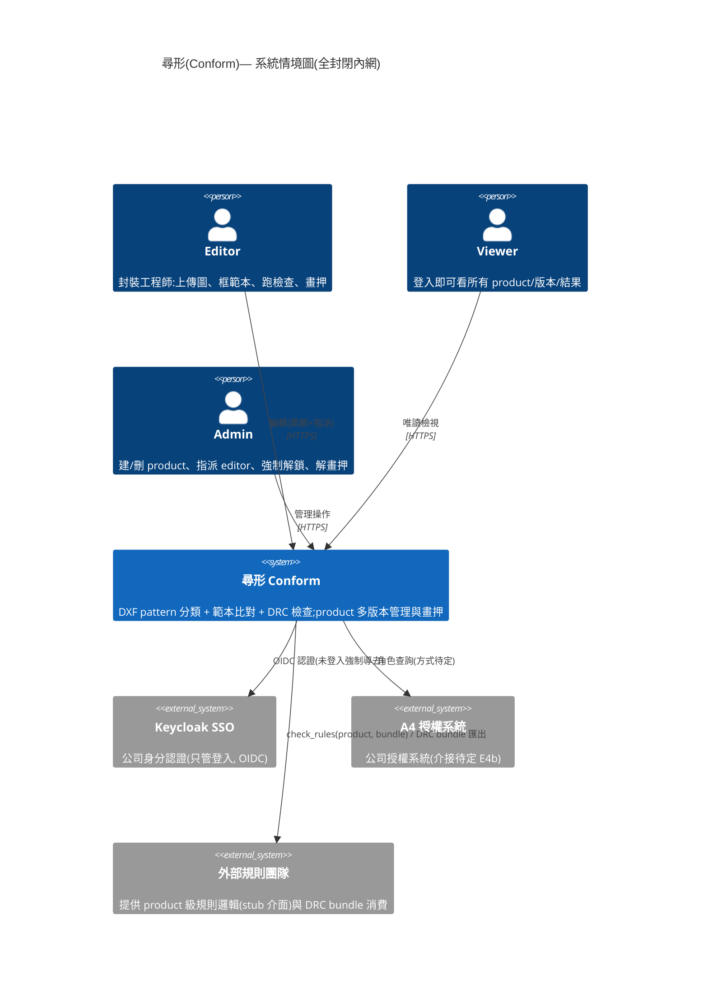

### 1.2 C4-L2:Container

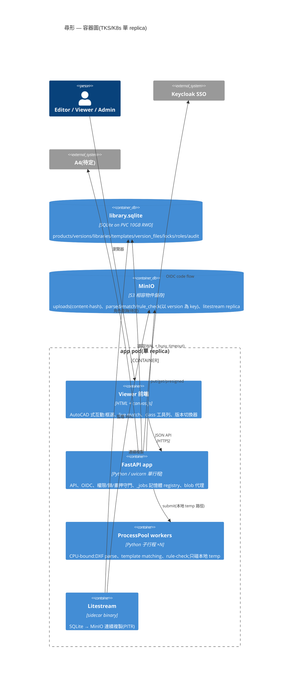

### 1.3 C4-L3:Component(FastAPI app 內部)

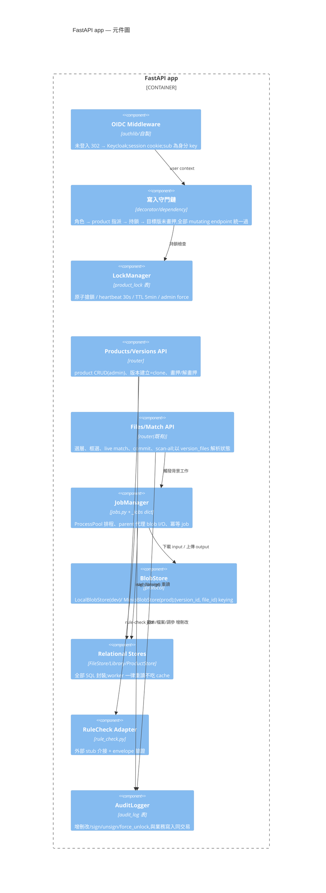

---

## 2. 系統流程圖(end-to-end 業務流程)

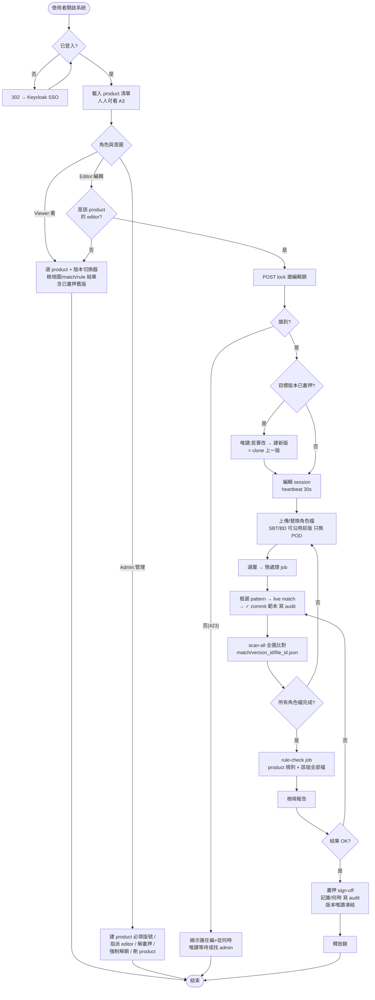

---

## 3. DFD(資料流圖)

### 3.1 DFD-L0(Context)

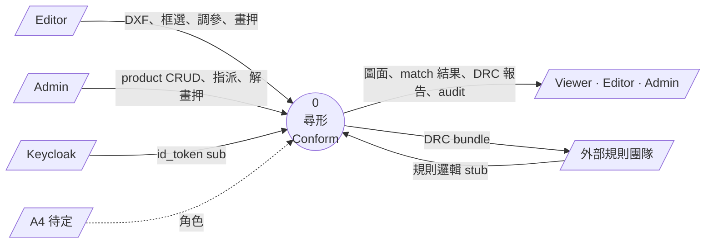

### 3.2 DFD-L1(主要 process 與 data store)

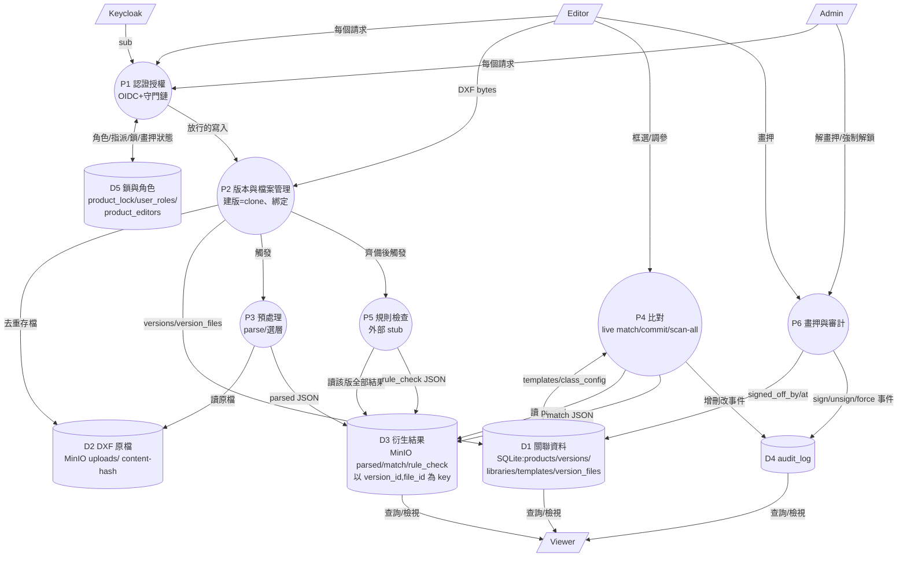

---

## 4. UML

### 4.1 Use Case 圖(近似表示)

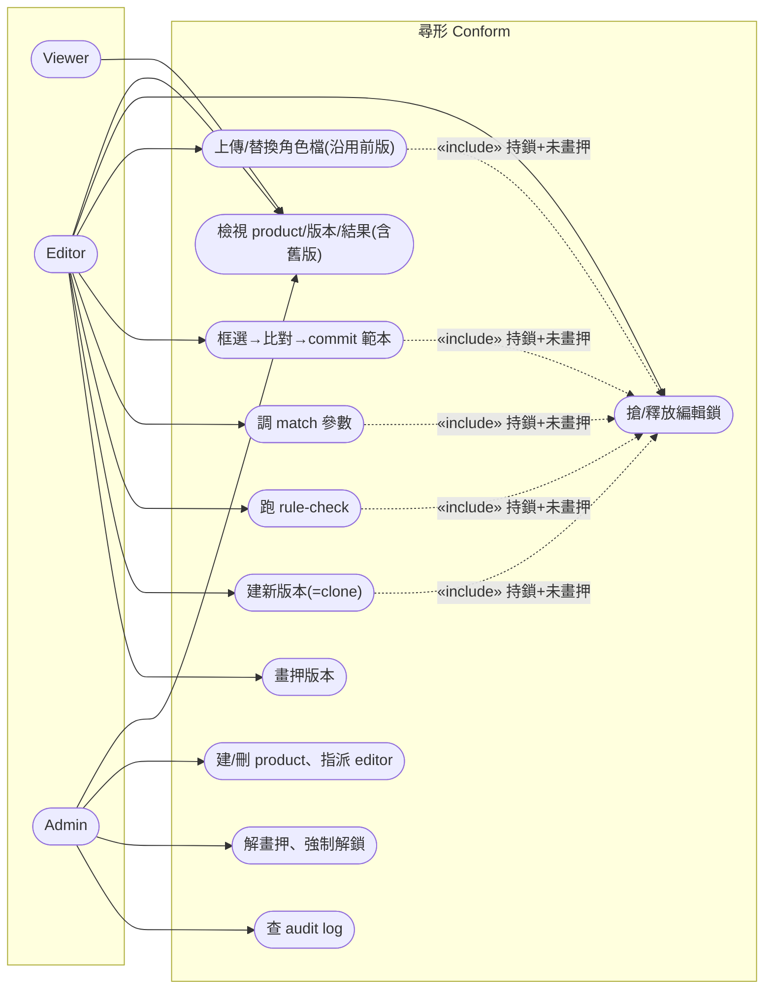

### 4.2 Class 圖(領域模型)

```mermaid
classDiagram
    class Product {
        +str id
        +str name
        +rules() 外部stub 跨版不變
    }
    class Version {
        +str id
        +str label  UNIQUE per product
        +str signed_off_by  NULL=編輯中
        +float signed_off_at
        +sign_off(user)
        +unsign(admin)
        +is_frozen() bool
    }
    class Library {
        +str id
        +clone() Library  建新版用
    }
    class ClassConfig {
        +str name
        +str strategy
        +float bbox_ratio
    }
    class Template {
        +str id
        +str class_name
        +json entity_point_sets
        +signature() dedup用
    }
    class VersionFile {
        +str role  SBT|BD|POD|RING|LID
        +json selected_layers
        +json overrides
    }
    class File {
        +str id  content-hash
        +int size
    }
    class ProductLock {
        +str holder_sub
        +float heartbeat_at
        +claim(user) atomic
        +is_expired() TTL 5min
    }
    class ProductEditor {
        +str user_sub
    }
    class AuditEntry {
        +float ts
        +str user_sub
        +str action
        +str target_type
        +str target_id
    }

    Product "1" *-- "1..*" Version : 容器(不可刪版)
    Version "1" *-- "1" Library : 1:1 快照
    Library "1" *-- "*" Template
    Library "1" *-- "*" ClassConfig
    Version "1" *-- "0..5" VersionFile : role 綁定
    VersionFile "*" --> "1" File : 跨版共用
    Product "1" o-- "0..1" ProductLock
    Product "1" o-- "*" ProductEditor
    Product "1" o-- "*" AuditEntry
```

### 4.3 Sequence 圖:建新版 → 換 POD → 比對 → 畫押

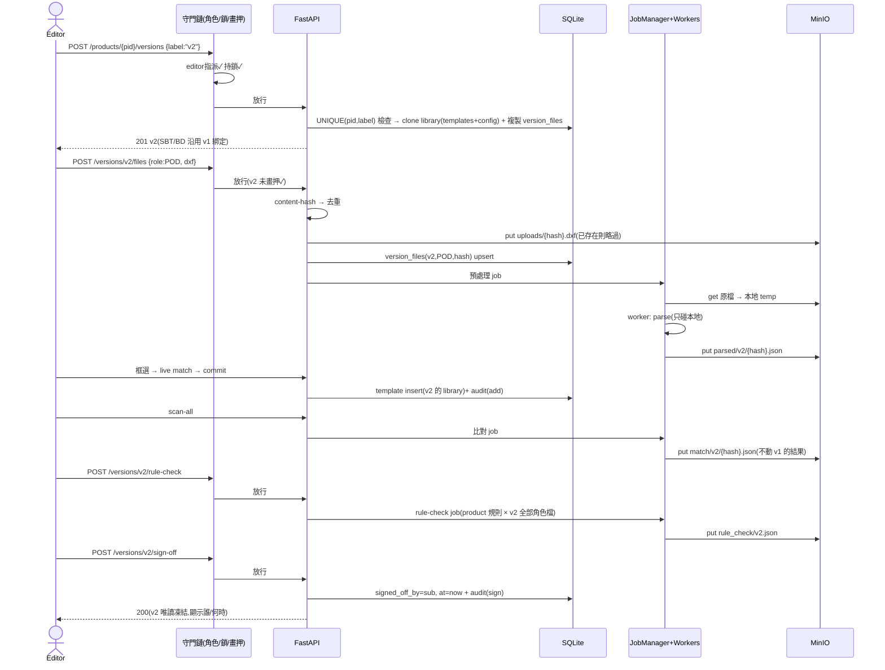

### 4.4 Sequence 圖:鎖競爭與 admin 介入

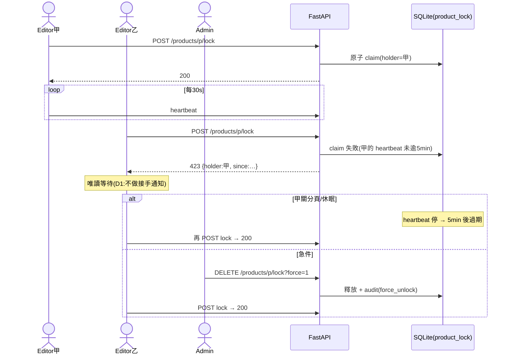

### 4.5 State 圖:Version 生命週期

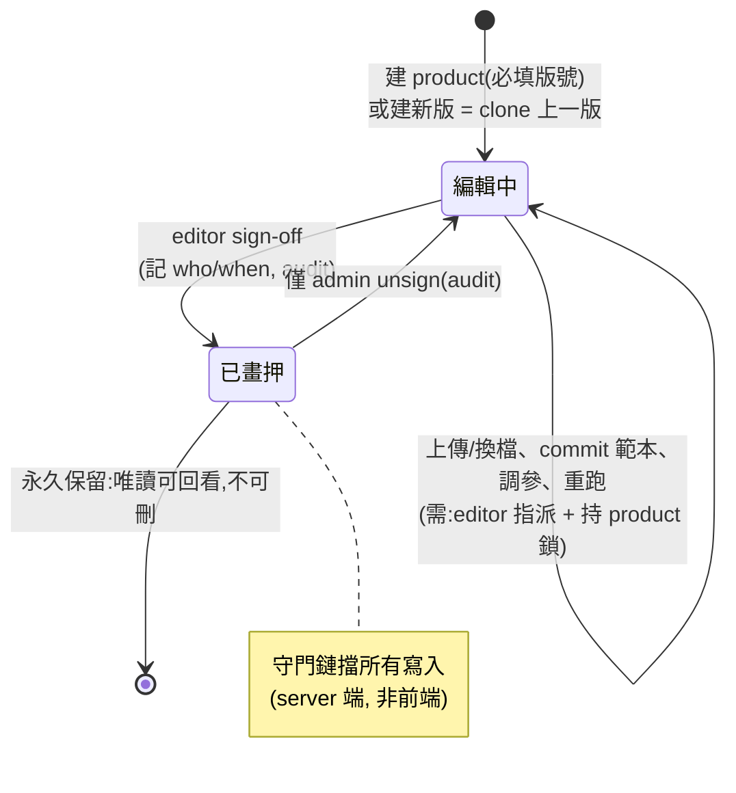

### 4.6 State 圖:檔案處理管線(單一角色檔)

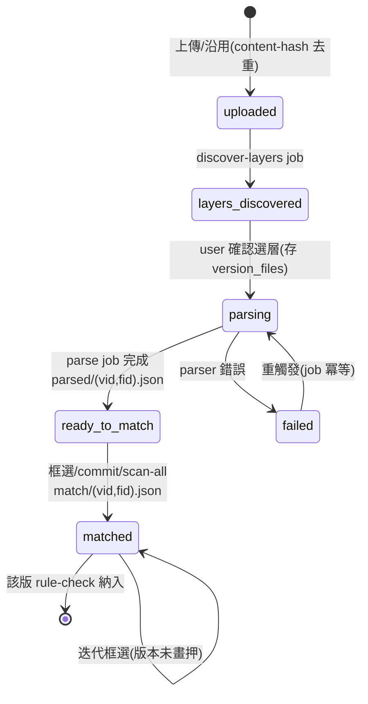

### 4.7 Activity 圖:寫入守門鏈(所有 mutating endpoint)

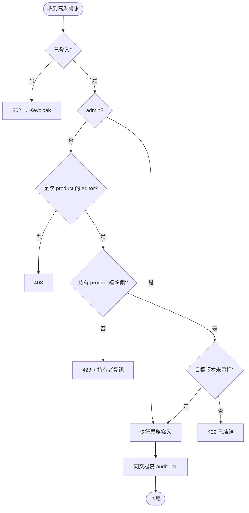

---

## 索引:圖 ↔ 設計書章節

| 圖 | 對應 system-design.md |
|---|---|
| C4 L1/L2/L3 | §6 高層架構、§7 細部設計 |
| 系統流程圖 | §4 API、§7.1/7.3/7.4 |
| DFD L0/L1 | §5.2 blob 佈局、§7.4 管線 |
| UML use case / class | §2 需求、§5.1 資料模型 |
| UML sequence ×2 | §7.1 鎖、§7.3 版本、§7.4 管線 |
| UML state ×2 | §7.3 生命週期、§7.4 管線 |
| Activity(守門鏈) | §4 權限矩陣與守門順序 |
